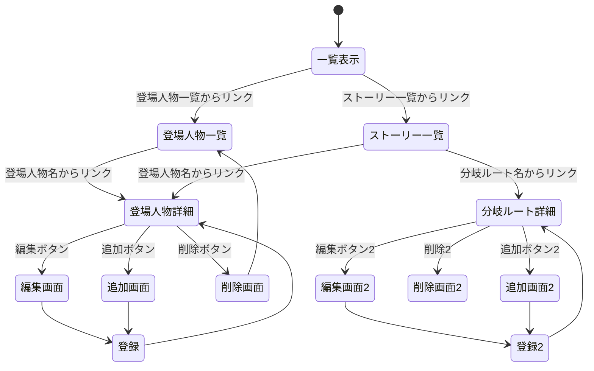

<!-- ・データ構造
・ページ遷移
  どうやってページ遷移するか？（ページ内のリンク，駅名をクリックなど）
  HTTPメソッドとリソース名
  追加・削除・編集後に表示する内容
・リソースごとの機能の詳細 -->

# 開発者用仕様書(仮)

本開発者用仕様書では，提供する3つのシステム(ダンガンロンパ攻略システム，NEEDY GIRL OVERDOSE攻略システム,ファミレスを享受せよ攻略システム)に関するデータ構造，ページ遷移ならびにリソースごとの機能について説明を行う．

## データ構造
本システムにおけるデータ構造を表に示す．

### ダンガンロンパ
はじめに，ダンガンロンパ攻略システムにおけるデータ構造について下記の表に示す．

項目名 | 型 | 内容 
-|-|- 
character | 文字列 | 登場人物
birth | 数値 | 誕生日
cast | 文字列 | 声優
title | 文字列 | 登場人物の肩書
chara_detail | 文字列　| 登場人物紹介
chapter | 数値 | チャプター
day | 数値　| (非)日常編
evidence | 文字列 | 必要となる証拠
place | 文字列 | 証拠がある場所
trial | 数値　| 学校裁判
choice | 文字列　| 選択肢の解答
discuss | 文字列 | 指摘する言葉(言弾)
write | 文字列 |　入力する言葉(閃きアナグラム)
punishment | 文字列 | 処刑内容(おしおき)

### NEEDY GIRL OVERDOSE
次に，NEEDY GIRL OVERDOSE攻略システムにおけるデータ構造について下記の表に示す．

項目名 | 型 | 内容 
-|-|-
character | 文字列 | 登場人物
birth | 数値 | 誕生日
cast | 文字列 | 声優
chara_detail | 文字列　| 登場人物紹介
ending | 文字列 |　エンディング名
followers | 数値 | フォロワー数
like | 数値 | 好感度
dislike | 数値　| やみ度
other | 文字列 | その他分岐を踏むための条件

### ファミレスを享受せよ
最後に，ファミレスを享受せよ攻略システムにおけるデータ構造について下記の表に示す．

項目名 | 型 | 内容 
-|-|-
character | 文字列 | 登場人物
chara_detail | 文字列　| 登場人物紹介
ending | 文字列 |　エンディング
route | 文字列 | 分岐箇所
route_detail | 文字列 | 選択肢を選んだ際に取得できるもの
other | 文字列 | 間違い探しの解答

## ページ遷移
本システムにおけるページ遷移について説明を行う．

ページの遷移の仕方に関しては登場人物の名前やエンディングの名前をクリックする方式を採用する．また，ページ遷移案を下記のフローチャートに示す．本システムで紹介する作品は、マルチエンディングと呼ばれる種類であり，またプレイヤーによる選択により異なる会話やアイテムを取得できる．そのため，分岐する場所がわかるよう，ストーリー一覧では時系列順に出力されるようにし，分岐する箇所をクリックすることにより分岐ルート詳細へとページが遷移する．

具体的なメソッド名やリソース名に関して，現在検討中であるため割愛する．

## リソースごとの機能の詳細
ページ遷移と同様．

